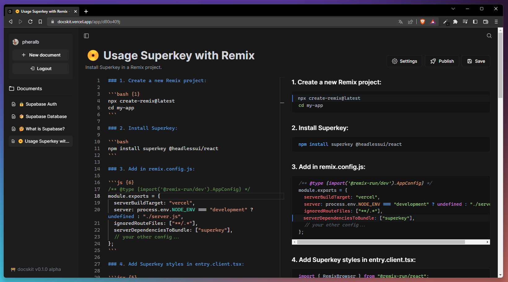

<div align="center">

<a href="docskit.vercel.app">

</a>

<p></p>

<a href="#-introduction">Introduction</a>
<span>&nbsp;&nbsp;•&nbsp;&nbsp;</span>
<a href="#-packages">Packages</a>
<span>&nbsp;&nbsp;•&nbsp;&nbsp;</span>
<a href="#-development">Development</a>
<span>&nbsp;&nbsp;•&nbsp;&nbsp;</span>
<a href="#-deployment">Deployment</a>


</div>

## 👋 Introduction

**[docskit](https://docskit.vercel.app/)** is a web app to create simple & beautiful docs using Markdown in your browser.

## 🌳 Supabase Launch Week 6 Hackathon

**A brief description of how used Supabase**:

- [x] **[Supabase Auth](https://supabase.com/docs/guides/auth/overview)** - auth via GitHub.
- [x] **[Supabase Database](https://supabase.com/docs/guides/database)** - your docs are saved using an incredible Postgres database.

**Team members**:

- Pablo Hdez - [Twitter](https://twitter.com/pheralb_).

## 📸 Screenshot

<div align="center">



</div>

## 📦 Packages

- **[Remix + Typescript](https://remix.run/)** - Build better websites.
- **[Tailwind CSS](https://tailwindcss.com/)** - Utility-first CSS framework.
- **[Headless UI](https://headlessui.com/)** - Unstyled, fully accessible UI components.
- **[Supabase v2](https://supabase.com/docs/reference/javascript/introduction)** - Supabase Javascript client library.
- **[Supabase Remix Auth Helper](https://supabase.com/docs/guides/auth/auth-helpers/remix)** - user authentication in Remix applications.
- **[Superkey](https://superkey.vercel.app/)** - A stylized command menu for React.
- **[Monaco Editor for React](https://github.com/suren-atoyan/monaco-react)** - use the monaco-editor in any React application.
- **[React-Markdown](https://github.com/remarkjs/react-markdown)** - Markdown component for React.
- **[React-Hook-Form](https://react-hook-form.com/)** - performant, flexible and extensible forms with easy-to-use validation.
- **[Framer Motion](https://www.framer.com/motion/)** - Production-Ready animation library for React.
- **[React-Icons](https://react-icons.github.io/react-icons/)** - popular icons in your React projects.

## 🔧 Development

To run docskit locally, follow the next steps:

1. Clone or [fork](https://github.com/pheralb/docskit/fork) the repository:

```sh
git@github.com:pheralb/docskit.git
cd docskit
```

2. Install dependencies with your favorite package manager:

```sh
# npm:
npm install
# pnpm:
pnpm install
# ultra:
ultra install
# yarn:
yarn install
```

3. Create a **.env** file (root directory) with the following content:

```sh
SUPABASE_URL:
SUPABASE_ANON_KEY:
```

4. Getting started with Supabase & Github OAuth:

**Supabase:**

- **[Create a new database](https://database.new/)**.
- Go to **Authentication** -> **Providers** and activate **Github** [*].
- Go to **SQL Editor** -> click on **New Query** and **[run this query](https://github.com/pheralb/docskit/blob/main/db.sql)** (db.sql).
- Go to **Settings** -> **API** and copy **Project URL** (SUPABASE_URL env) & **Project API keys** (SUPABASE_ANON_KEY env).

**Github OAuth:**

- **[Create a new Github OAuth app](https://github.com/settings/applications/new)**.
- [*] Copy **Client ID** and paste it into Github Secret.
- [*] Click on **Generate a new client secret** and paste it into Github Key. 

5. Start the Remix development server:

```sh
# npm:
npm run dev
# pnpm:
pnpm dev
# ultra:
ultra dev
# yarn:
yarn dev
```

And open up [http://localhost:3000](http://localhost:3000) 🎉

## 🚀 Deployment

- ▲ Vercel: [docskit.vercel.app](https://docskit.vercel.app/).

## 📄 License:

- [MIT License](https://github.com/pheralb/docskit/blob/main/LICENSE).